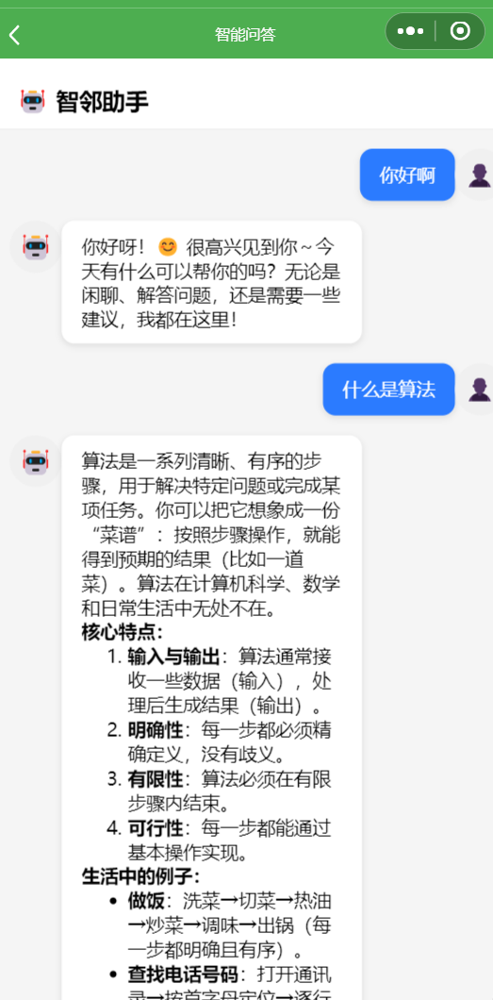
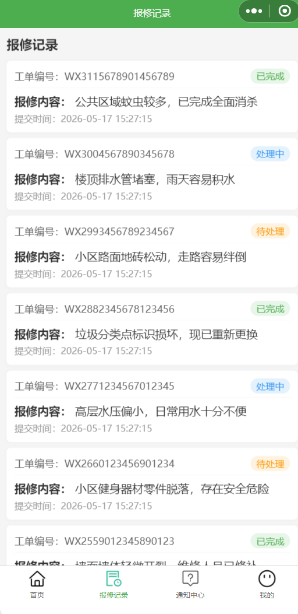
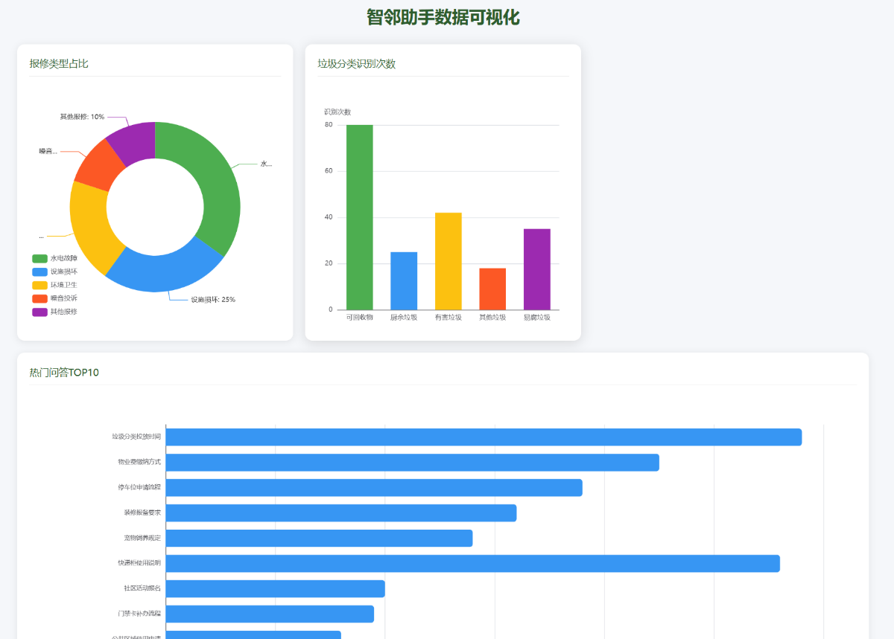
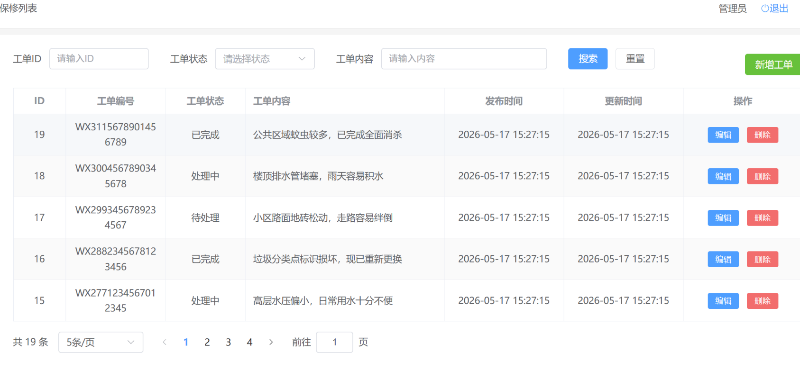
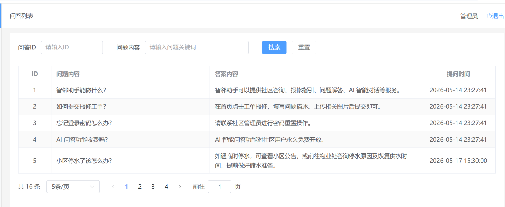

# 「慧邻帮」——社区智邻小助手

智慧社区服务解决方案，涵盖智能问答、一键报修、便民推荐等核心功能。小程序端面向居民，管理端为物业提供数据可视化与多表单管控。

## 技术栈

| 模块 | 技术 |
|------|------|
| 小程序端 | Uniapp |
| 管理端 | Vue3 + Element Plus + Pinia + ECharts |
| 后端 | Egg.js + MySQL + JWT |
| 构建工具 | Vite |

## 功能模块

### 智能问答
- 接入大模型 + 本地问答库兜底
- 设计优先策略，降低接口调用成本约 40%
- 响应时间控制在毫秒级

### 一键报修
- 居民端：图片上传、状态跟踪
- 管理端：智能派发与状态流转
- 形成闭环反馈

### 管理端数据看板
- 基于 ECharts 实现报修占比、识别次数、热门问答 TOP10 等可视化图表
- 支持日/周/月动态筛选

### 后端权限体系
- 基于 Egg.js + MySQL 设计五表结构（用户/问答/工单/服务/通知）
- JWT 鉴权与两级角色隔离（居民/管理员）
- 支持完整 CRUD

### 状态管理
- 使用 Pinia 封装用户信息、通知未读数等全局状态
- 实现跨页面数据共享

## 界面截图

### 小程序端 - 智能问答


### 小程序端 - 报修提交


### 管理端 - 数据看板


### 管理端 - 报修列表


### 管理端 - 问答管理


## 快速启动

```bash
# 克隆项目
git clone https://github.com/Luosj007/aiCommunityHelper-uniapp.git

# 安装依赖
cd aiCommunityHelper-uniapp
npm install
